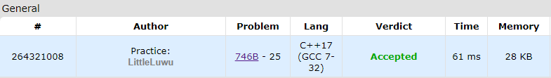

# 👨‍💻 Decoding

**Fonte: [Codeforces](https://codeforces.com/contest/746/problem/B)**

Polycarp is mad about coding, that is why he writes Sveta encoded messages. He calls the median letter in a word the letter which is in the middle of the word. If the word's length is even, the median letter is the left of the two middle letters. In the following examples, the median letter is highlighted: contest, info. If the word consists of single letter, then according to above definition this letter is the median letter.

Polycarp encodes each word in the following way: he writes down the median letter of the word, then deletes it and repeats the process until there are no letters left. For example, he encodes the word volga as logva.

You are given an encoding s of some word, your task is to decode it.

### Entrada
The first line contains a positive integer n ($1 ≤ n ≤ 2000$) — the length of the encoded word.

The second line contains the string s of length n consisting of lowercase English letters — the encoding.

### Saída
Print the word that Polycarp encoded.

## 🧩 Processo de Resolução

> Detalhamento do processo em progresso..

## 📝 Corretude da Solução
A solução desenvolvida passou em todos os casos de testes.

