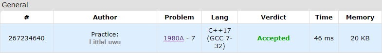

# 👩‍🏫 Problem Generator

**Fonte: [Codeforces](https://codeforces.com/contest/1980/problem/A)**

Vlad is planning to hold m rounds next month. Each round should contain one problem of difficulty levels 'A', 'B', 'C', 'D', 'E', 'F', and 'G'.

Vlad already has a bank of n problems, where the i-th problem has a difficulty level of $ai$. There may not be enough of these problems, so he may have to come up with a few more problems.

Vlad wants to come up with as few problems as possible, so he asks you to find the minimum number of problems he needs to come up with in order to hold m rounds.

For example, if m=1, n=10, a='BGECDCBDED', then he needs to come up with two problems: one of difficulty level 'A' and one of difficulty level 'F'.

### Entrada
The first line contains a single integer t ($1≤t≤1000$) — the number of test cases.

The first line of each test case contains two integers n and m ($1≤n≤50$, $1≤m≤5$) — the number of problems in the bank and the number of upcoming rounds, respectively.

The second line of each test case contains a string a of n characters from 'A' to 'G' — the difficulties of the problems in the bank.

### Saída
For each test case, output a single integer — the minimum number of problems that need to come up with to hold m rounds.

## 🧩 Processo de Resolução

> Detalhamento do processo em progresso..

## 📝 Corretude da Solução
A solução desenvolvida passou em todos os casos de testes.

