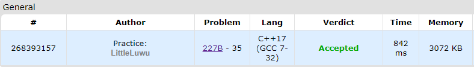

# 💡 Effective Approach

**Fonte: [Codeforces](https://codeforces.com/contest/227/problem/B)**

Once at a team training Vasya, Petya and Sasha got a problem on implementing linear search in an array.

According to the boys, linear search works as follows. The array elements in a pre-selected order are in turn compared with the number that you need to find. Once you find the array element that is equal to the required one, the search ends. The efficiency of the algorithm is the number of performed comparisons. The fewer comparisons the linear search has made, the more effective it is.

Vasya believes that a linear search would work better if it sequentially iterates through the elements, starting with the 1-st one (in this problem we consider the elements of the array indexed from 1 to n) and ending with the n-th one. And Petya says that Vasya is wrong: the search will need less comparisons if it sequentially iterates the elements starting from the n-th and ending with the 1-st one. Sasha argues that the two approaches are equivalent.

To finally begin the task, the teammates decided to settle the debate and compare the two approaches on an example. For this, they took an array that is a permutation of integers from 1 to n, and generated m queries of the form: find element with value bi in the array. They want to calculate for both approaches how many comparisons in total the linear search will need to respond to all queries. If the first search needs fewer comparisons, then the winner of the dispute is Vasya. If the second one does, then the winner is Petya. If both approaches make the same number of comparisons, then Sasha's got the upper hand.

But the problem is, linear search is too slow. That's why the boys aren't going to find out who is right before the end of the training, unless you come in here. Help them to determine who will win the dispute.

### Entrada
he first line contains integer n ($1 ≤ n ≤ 10^5$) — the number of elements in the array. The second line contains n distinct space-separated integers $a1, a2, ..., an$ ($1 ≤ ai ≤ n$) — the elements of array.

The third line contains integer m ($1 ≤ m ≤ 10^5$) — the number of queries. The last line contains m space-separated integers $b1, b2, ..., bm$ ($1 ≤ bi ≤ n$) — the search queries. Note that the queries can repeat.

### Saída
Print two integers, showing how many comparisons Vasya's approach needs and how many comparisons Petya's approach needs. Separate the numbers by spaces.

Please, do not use the %lld specifier to read or write 64-bit integers in С++. It is preferred to use cin, cout streams or the %I64d specifier.

## 🧩 Processo de Resolução

> Detalhamento do processo em progresso..

## 📝 Corretude da Solução
A solução desenvolvida passou em todos os casos de testes.

