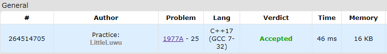

# 🧊 Little Nikita

**Fonte: [Codeforces](https://codeforces.com/contest/1977/problem/A)**

The little boy Nikita was given some cubes as a present. He decided to build a tower out of them.

Initially, the tower doesn't have any cubes. In one move, Nikita either puts exactly 1 cube on top of the tower or removes exactly 1 cube from the top of the tower. Is it possible that after n moves, the resulting tower has exactly m cubes?

### Entrada
Each test contains multiple test cases. The first line of input contains a single integer t ($1≤t≤100$) — the number of test cases. The description of the test cases follows.

The only line of each test case contains two integers n and m ($1≤n,m≤100$).

### Saída
For each test case, output "Yes" (without quotes) if Nikita can obtain a tower with m cubes, and "No" (without quotes) otherwise.

You can output each letter in any case (lowercase or uppercase). For example, the strings "yEs", "yes", "Yes", and "YES" will be accepted as a positive answer.

## 🧩 Processo de Resolução

> Detalhamento do processo em progresso..

## 📝 Corretude da Solução
A solução desenvolvida passou em todos os casos de testes.

