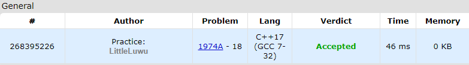

# 📱 Phone Desktop

**Fonte: [Codeforces](https://codeforces.com/problemset/problem/1974/A)**

Little Rosie has a phone with a desktop (or launcher, as it is also called). The desktop can consist of several screens. Each screen is represented as a grid of size 5×3, i.e., five rows and three columns.

There are x applications with an icon size of 1×1 cells; such an icon occupies only one cell of the screen. There are also y applications with an icon size of 2×2 cells; such an icon occupies a square of 4 cells on the screen. Each cell of each screen can be occupied by no more than one icon.

Rosie wants to place the application icons on the minimum number of screens. Help her find the minimum number of screens needed.

### Entrada
The first line of the input contains t ($1≤t≤10^4$) — the number of test cases.

The first and only line of each test case contains two integers x and y ($0≤x,y≤99$) — the number of applications with a 1×1 icon and the number of applications with a 2×2 icon, respectively.

### Saída
For each test case, output the minimal number of required screens on a separate line.

## 🧩 Processo de Resolução

> Detalhamento do processo em progresso..

## 📝 Corretude da Solução
A solução desenvolvida passou em todos os casos de testes.

