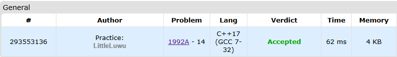

# ➕ Only Pluses

**Fonte: [Codeforces](https://codeforces.com/contest/1992/problem/A)**

Kmes has written three integers a, b and c in order to remember that he has to give Noobish_Monk a×b×c bananas.

Noobish_Monk has found these integers and decided to do the following at most 5 times:

pick one of these integers;increase it by 1.For example, if a=2, b=3 and c=4, then one can increase a three times by one and increase b two times. After that a=5, b=5, c=4. Then the total number of bananas will be 5×5×4=100.

What is the maximum value of a×b×c Noobish_Monk can achieve with these operations?

### Entrada
Each test contains multiple test cases. The first line of input contains a single integer t $(1≤t≤1000)$ — the number of test cases. The description of the test cases follows.

The first and only line of each test case contains three integers a, b and c $(1≤a,b,c≤10)$ — Kmes's integers.

### Saída
For each test case, output a single integer — the maximum amount of bananas Noobish_Monk can get.

## 🧩 Processo de Resolução

> Detalhamento do processo em progresso..

## 📝 Corretude da Solução
A solução desenvolvida passou em todos os casos de testes.

