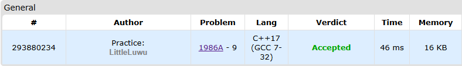

# 📉 X Axis

**Fonte: [Codeforces](https://codeforces.com/contest/1986/problem/A)**

You are given three points with integer coordinates $x_1$, $x_2$, and $x_3$ on the X axis ($1≤x_i≤10$). You can choose any point with an integer coordinate a on the X axis. Note that the point a may coincide with $x_1$, $x_2$, or $x_3$. Let $f(a)$ be the total distance from the given points to the point a. Find the smallest value of $f(a)$.

The distance between points $a$ and $b$ is equal to $|a−b|$. For example, the distance between points $a=5$ and $b=2$ is 3.

### Entrada
Each test consists of multiple test cases. The first line contains a single integer $t$ ($1≤t≤10^3$) — the number of test cases. Then follows their descriptions.

The single line of each test case contains three integers $x_1$, $x_2$, and $x_3$ ($1≤x_i≤10$) — the coordinates of the points.

### Saída
For each test case, output the smallest value of $f(a)$.

## 🧩 Processo de Resolução

> Detalhamento do processo em progresso..

## 📝 Corretude da Solução
A solução desenvolvida passou em todos os casos de testes.

