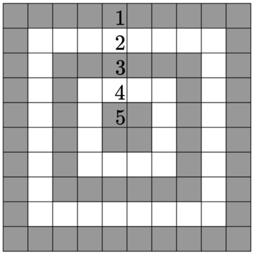

# 🎯 Target Practice

**Fonte: [Codeforces](https://codeforces.com/contest/1873/problem/C)**

A $10×10$ target is made out of five "rings" as shown. Each ring has a different point value: the outermost ring — 1 point, the next ring — 2 points, ..., the center ring — 5 points.

Vlad fired several arrows at the target. Help him determine how many points he got.

### Entrada
The input consists of multiple test cases. The first line of the input contains a single integer $t$ ($1≤t≤1000$) — the number of test cases.

Each test case consists of 10 lines, each containing 10 characters. Each character in the grid is either $X$ (representing an arrow) or $.$ (representing no arrow).

### Saída
For each test case, output a single integer — the total number of points of the arrows.

## 🧩 Processo de Resolução

> Detalhamento do processo em progresso..

## 📝 Corretude da Solução
A solução desenvolvida passou em todos os casos de testes.

