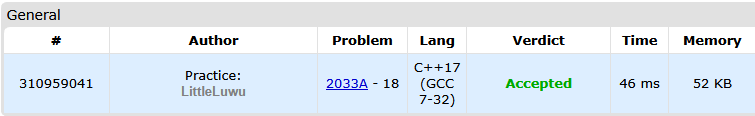

# 🌸 Sakurako and Kosuke

**Fonte: [CodeForces](https://codeforces.com/problemset/problem/2033/A)**

Sakurako and Kosuke decided to play some games with a dot on a coordinate line. The dot is currently located in position $x=0$. They will be taking turns, and Sakurako will be the one to start.

On the $i$-th move, the current player will move the dot in some direction by $2⋅i−1$ units. Sakurako will always be moving the dot in the negative direction, whereas Kosuke will always move it in the positive direction.

In other words, the following will happen:

1. Sakurako will change the position of the dot by $−1$, $x=−1$ now

2. Kosuke will change the position of the dot by $3$, $x=2$ now

3. Sakurako will change the position of the dot by $−5$, $x=−3$ now

4. ⋯

They will keep on playing while the absolute value of the coordinate of the dot does not exceed $n$. More formally, the game continues while $−n≤x≤n$. It can be proven that the game will always end.

Your task is to determine who will be the one who makes the last turn.

### Entrada
The first line contains one integer $t$ ($1≤t≤100$) — the number of games that Sakurako and Kosuke played.

Each game is described by one number $n$ ($1≤n≤100$) — the number that defines the condition when the game ends.

### Saída
For each of the $t$ games, output a line with the result of that game. If Sakurako makes the last turn, output "Sakurako" (without quotes); else output "Kosuke".

## 🧩 Processo de Resolução

> Detalhamento do processo em progresso..

## 📝 Corretude da Solução
A solução desenvolvida passou em todos os casos de testes.

