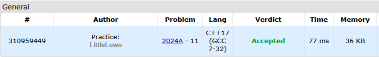

# 💵 Profitable Interest Rate

**Fonte: [CodeForces](https://codeforces.com/problemset/problem/2024/A)**

Alice has $a$ coins. She can open a bank deposit called "Profitable", but the minimum amount required to open this deposit is $b$ coins.

There is also a deposit called "Unprofitable", which can be opened with any amount of coins. Alice noticed that if she opens the "Unprofitable" deposit with $x$ coins, the minimum amount required to open the "Profitable" deposit decreases by $2x$ coins. However, these coins cannot later be deposited into the "Profitable" deposit.

Help Alice determine the maximum number of coins she can deposit into the "Profitable" deposit if she first deposits some amount of coins (possibly $0$) into the "Unprofitable" deposit. If Alice can never open the "Profitable" deposit, output $0$.

### Entrada
Each test consists of multiple test cases. The first line contains a single integer $t$ ($1≤t≤10^4$) — the number of test cases. The description of the test cases follows.

A single line of each test case contains two integers $a$ and $b$ ($1≤a,b≤10^9$) — the number of coins Alice has and the initial minimum amount required to open the "Profitable" deposit.

### Saída
For each test case, output a single integer — the maximum number of coins that Alice can deposit into the "Profitable" deposit. If Alice can never open the "Profitable" deposit, output $0$.

## 🧩 Processo de Resolução

> Detalhamento do processo em progresso..

## 📝 Corretude da Solução
A solução desenvolvida passou em todos os casos de testes.

