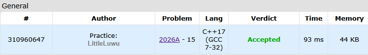

# 📏 Perpendicular Segments

**Fonte: [CodeForces](https://codeforces.com/contest/2026/problem/A)**

You are given a coordinate plane and three integers $X$, $Y$, and $K$. Find two line segments $AB$ and $CD$ such that

1. the coordinates of points $A$, $B$, $C$, and $D$ are integers;

2. $0≤Ax,Bx,Cx,Dx≤X$ and $0≤Ay,By,Cy,Dy≤Y$;

3. the length of segment $AB$ is at least $K$;

4. the length of segment $CD$ is at least $K$;

5. segments $AB$ and $CD$ are perpendicular: if you draw lines that contain $AB$ and $CD$, they will cross at a right angle.

Note that it's not necessary for segments to intersect. Segments are perpendicular as long as the lines they induce are perpendicular.

### Entrada
The first line contains a single integer $t$ ($1≤t≤5000$) — the number of test cases. Next, $t$ cases follow.

The first and only line of each test case contains three integers $X$, $Y$, and $K$ ($1≤X,Y≤1000$; $1≤K≤1414$).

Additional constraint on the input: the values of $X$, $Y$, and $K$ are chosen in such a way that the answer exists.

### Saída
For each test case, print two lines. The first line should contain $4$ integers $A_x$, $A_y$, $B_x$, and $B_y$ — the coordinates of the first segment.

The second line should also contain $4$ integers $C_x$, $C_y$, $D_x$, and $D_y$ — the coordinates of the second segment.

If there are multiple answers, print any of them.

## 🧩 Processo de Resolução

> Detalhamento do processo em progresso..

## 📝 Corretude da Solução
A solução desenvolvida passou em todos os casos de testes.

