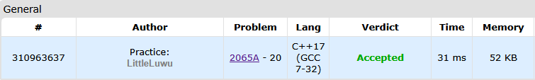

# 👾 Skibidus and Amog'u

**Fonte: [Codeforces](https://codeforces.com/contest/2065/problem/A)**

Skibidus lands on a foreign planet, where the local Amog tribe speaks the Amog'u language. In Amog'u, there are two forms of nouns, which are singular and plural.

Given that the root of the noun is transcribed as $S$, the two forms are transcribed as:

- Singular: $S + "us"$

- Plural: $S + "i"$

Here, $+$ denotes string concatenation. For example, $abc + def = abcdef$.

For example, when $S$ is transcribed as "amog", then the singular form is transcribed as "amogus", and the plural form is transcribed as "amogi". Do note that Amog'u nouns can have an empty root — in specific, "us" is the singular form of "i" (which, on an unrelated note, means "imposter" and "imposters" respectively).

Given a transcribed Amog'u noun in singular form, please convert it to the transcription of the corresponding plural noun.

### Entrada
Each test contains multiple test cases. The first line contains the number of test cases $t$ ($1≤t≤100$). The description of the test cases follows.

The only line of each test case contains a string $W$, which is a transcribed Amog'u noun in singular form. It is guaranteed that $W$ consists of only lowercase English letters, has a length of at most $10$, and ends with "us".

### Saída
For each test case, output the transcription of the corresponding plural noun on a separate line.

## 🧩 Processo de Resolução

> Detalhamento do processo em progresso..

## 📝 Corretude da Solução
A solução desenvolvida passou em todos os casos de testes.

