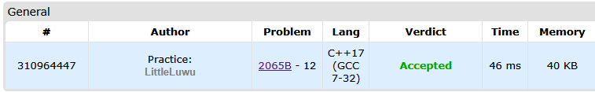

# 🚽 Skibidus and Ohio

**Fonte: [Codeforces](https://codeforces.com/contest/2065/problem/B)**

Skibidus is given a string $s$ that consists of lowercase Latin letters. If $s$ contains more than $1$ letter, he can:

- Choose an index $i$ ($1≤i≤|s|−1$, $|s|$ denotes the current length of $s$) such that $s_i=s_i+1$. Replace $s_i$ with any lowercase Latin letter of his choice. Remove $s_i+1$ from the string.

Skibidus must determine the minimum possible length he can achieve through any number of operations.

### Entrada
The first line contains an integer $t$ ($1≤t≤100$) — the number of test cases.

The only line of each test case contains a string $s$ ($1≤|s|≤100$). It is guaranteed $s$ only contains lowercase Latin letters.

### Saída
For each test case, output an integer on the new line, the minimum achievable length of $s$.

## 🧩 Processo de Resolução

> Detalhamento do processo em progresso..

## 📝 Corretude da Solução
A solução desenvolvida passou em todos os casos de testes.

