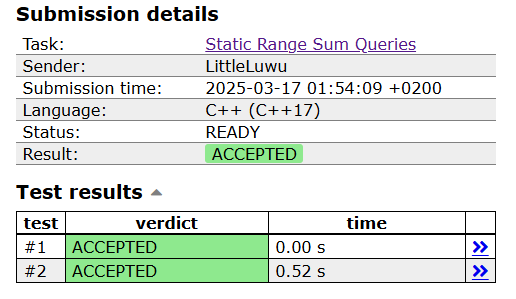

# ➕ Static Range Sum Queries

**Fonte: [CSES](https://cses.fi/problemset/task/1646)**

Given an array of $n$ integers, your task is to process $q$ queries of the form: what is the sum of values in range $[a,b]$?

### Entrada
The first input line has two integers $n$ and $q$: the number of values and queries.

The second line has n integers $x_1,x_2,\dots,x_n:$ the array values.

Finally, there are q lines describing the queries. Each line has two integers $a$ and $b$: what is the sum of values in range $[a,b]$?

### Saída
Print the result of each query.

## 🧩 Processo de Resolução

> Detalhamento do processo em progresso..

## 📝 Corretude da Solução
A solução desenvolvida passou em todos os casos de testes.

