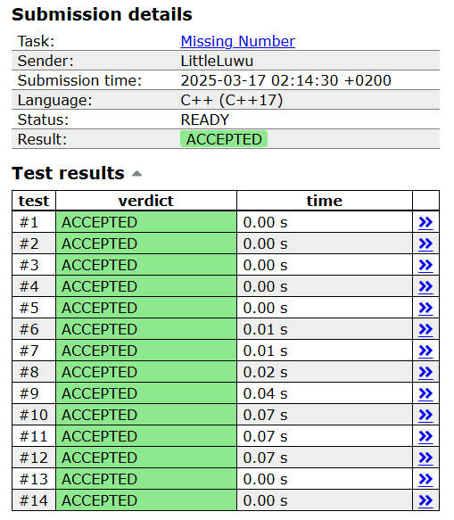

# 🔢 Missing Number

**Fonte: [CSES](https://cses.fi/problemset/task/1083)**

You are given all numbers between $1,2,\ldots,n$ except one. Your task is to find the missing number.

### Entrada

The first input line contains an integer $n$.

The second line contains $n-1$ numbers. Each number is distinct and between $1$ and $n$ (inclusive).

### Saída
Print the missing number.

## 🧩 Processo de Resolução

> Detalhamento do processo em progresso..

## 📝 Corretude da Solução
A solução desenvolvida passou em todos os casos de testes.

