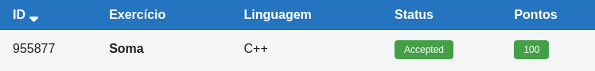

# 🧮 Soma

**Fonte: [Neps Academy](https://neps.academy/br/exercise/84)**

Faça um programa que leia dois números inteiros digitados pelo teclado e imprima a soma deles.

### Entrada

A entrada consiste de dois números inteiros *`X`* e *`Y`*, um em cada linha.

### Saída
A saída do seu programa deve ser um inteiro *`S`*, representando a soma de *`X`* e *`Y`*.

## 🧩 Processo de Resolucao

> Detalhamento do processo em progresso...

## 📝 Corretude da Solucao

A solução desenvolvida passou em todos os casos de testes.

