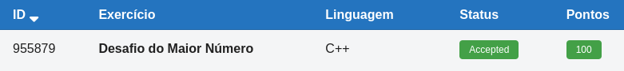

# 🔢 Desafio do Maior Número

**Fonte: [Neps Academy](https://neps.academy/br/exercise/323)**

Leonardo é um garoto muito criativo. Ele adora criar desafios para seus colegas da escola. Seu último desafio é o seguinte: diversos números são ditos em voz alta, quando o número 0 (zero) é dito então o desafio termina e seus colegas devem dizer imediatamente qual foi o maior número. Leonardo tem muita dificuldade de verificar se a resposta dada pelos colegas é correta ou não, pois a sequência de números costuma ser longa. Por este motivo, ele resolveu pedir sua ajuda.

Sua tarefa é escrever um programa que dada uma sequência de números inteiros positivos terminada por 0 (zero), imprime o maior número da sequência.

### Entrada
A entrada é dada em uma única linha contendo uma sequência de números inteiros positivos. O último número da linha é 0 (zero).

### Saída
Seu programa deve imprimir o maior número dentre os números da entrada.

### Restrições
- 1 ≤ tamanho da sequência ≤100
- 1 ≤ número da sequência ≤ 100

## 🧩 Processo de Resolução

> Detalhamento do processo em progresso...

## 📝 Corretude da Solução

A solução desenvolvida passou em todos os casos de testes.

