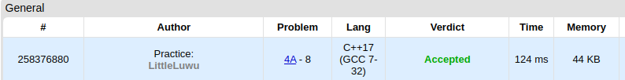

# 🍉 Watermelon

**Fonte: [Codeforces](https://codeforces.com/problemset/problem/4/A)**

One hot summer day Pete and his friend Billy decided to buy a watermelon. They chose the biggest and the ripest one, in their opinion. After that the watermelon was weighed, and the scales showed w kilos. They rushed home, dying of thirst, and decided to divide the berry, however they faced a hard problem.

Pete and Billy are great fans of even numbers, that's why they want to divide the watermelon in such a way that each of the two parts weighs even number of kilos, at the same time it is not obligatory that the parts are equal. The boys are extremely tired and want to start their meal as soon as possible, that's why you should help them and find out, if they can divide the watermelon in the way they want. For sure, each of them should get a part of positive weight.

### Entrada
The first (and the only) input line contains integer number w (1 ≤ w ≤ 100) — the weight of the watermelon bought by the boys.

### Saída
Print YES, if the boys can divide the watermelon into two parts, each of them weighing even number of kilos; and NO in the opposite case.

## 🧩 Processo de Resolução
A melancia precisa ser dividida em duas metades, cada metade pesando um valor par. Para verificarmos se isso é possível, precisamos analisar as possibilidades de peso que podemos ter como entrada. Caso o peso da melancia seja um valor ímpar, nao sera possivel dividir ela em duas metades de valor par. A outra possibilidade é de termos o peso com valor par, nesse caso como a divisão não precisa ser igualitária podemos dividir as metades com 2 | w-2 quilos respectivamente. Assim, ambas as metades são garantidas de sempre serem um valor par. Entretanto, temos que pensar no caso especial onde o peso da melancia tem valor 2. A propriedade continua valendo pois w-2 teria o valor 0 que é par, mas não podemos ter uma metade de zero kilos, então não é possível dividir nesse caso.

## 📝 Corretude da Solução
A solução desenvolvida passou em todos os casos de testes.

