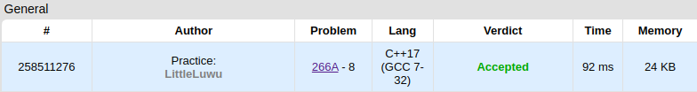

# 🗿 Stones on the Table

**Fonte: [Codeforces](https://codeforces.com/contest/266/problem/A)**

There are n stones on the table in a row, each of them can be red, green or blue. Count the minimum number of stones to take from the table so that any two neighboring stones had different colors. Stones in a row are considered neighboring if there are no other stones between them.

### Entrada
The first line contains integer n (1 ≤ n ≤ 50) — the number of stones on the table.

The next line contains string s, which represents the colors of the stones. We'll consider the stones in the row numbered from 1 to n from left to right. Then the i-th character s equals "R", if the i-th stone is red, "G", if it's green and "B", if it's blue.

### Saída
Print a single integer — the answer to the problem.

## 🧩 Processo de Resolução
A entrada nos fornece as pedras que estão dispostas sobre a mesa. O objetivo é saber quantas precisamos remover para que nenhuma pedra seja vizinha de sua própria cor. Para tal, cada pedra que esteja adjacente a sua própria cor necessita ser removida. Como a ideia não é remover as pedras ao longo da entrada e sim contar apenas quantas precisam ser removidas, não precisamos nos preocupar com a mesa mudando de estado a cada remoção. A contagem pode ser feita mantendo a informação da pedra anterior ao recebermos a entrada, e em caso delas terem a mesma cor marcamos uma remoção necessária. Assim, ao final temos o número de pedras que precisam ser removidas.

## 📝 Corretude da Solução
A solução desenvolvida passou em todos os casos de testes.

