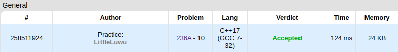

# 🚻 Boy or Girl

**Fonte: [Codeforces](https://codeforces.com/contest/236/problem/A)**

Those days, many boys use beautiful girls' photos as avatars in forums. So it is pretty hard to tell the gender of a user at the first glance. Last year, our hero went to a forum and had a nice chat with a beauty (he thought so). After that they talked very often and eventually they became a couple in the network.

But yesterday, he came to see "her" in the real world and found out "she" is actually a very strong man! Our hero is very sad and he is too tired to love again now. So he came up with a way to recognize users' genders by their user names.

This is his method: if the number of distinct characters in one's user name is odd, then he is a male, otherwise she is a female. You are given the string that denotes the user name, please help our hero to determine the gender of this user by his method.

### Entrada
The first line contains a non-empty string, that contains only lowercase English letters — the user name. This string contains at most 100 letters.

### Saída
If it is a female by our hero's method, print "CHAT WITH HER!" (without the quotes), otherwise, print "IGNORE HIM!" (without the quotes).

## 🧩 Processo de Resolução
Neste problema estamos interessados apenas nos caracteres únicos. Podemos contar sempre que vimos um caracter pela primeira vez e decidir se o nome pertence a uma pessoa do sexo feminino ou masculino. Afim de saber quando já vimos um caracter ou não, precisaremos de uma estrutura adicional contendo 26 espaços para marcar os caracteres que foram vistos. E consultando essa estrutura, verificamos para cada caracter se ele é único ou já foi visto na sequência. Assim, ao final só precisamos checar a paridade da contagem para realizar a decisão.

## 📝 Corretude da Solução
A solução desenvolvida passou em todos os casos de testes.

