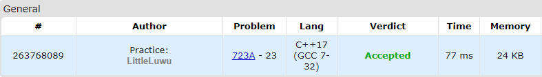

# 🌠 The New Year: Meeting Friends

**Fonte: [Codeforces](https://codeforces.com/problemset/problem/723/A)**

There are three friend living on the straight line Ox in Lineland. The first friend lives at the point $x_1$, the second friend lives at the point $x_2$, and the third friend lives at the point $x_3$. They plan to celebrate the New Year together, so they need to meet at one point. What is the minimum total distance they have to travel in order to meet at some point and celebrate the New Year?

It's guaranteed that the optimal answer is always integer.

### Entrada
The first line of the input contains three distinct integers $x_1$, $x_2$ and $x_3$ ($1 ≤ x_1, x_2, x_3 ≤ 100$) — the coordinates of the houses of the first, the second and the third friends respectively.

### Saída
Print one integer — the minimum total distance the friends need to travel in order to meet together.

## 🧩 Processo de Resolução

> Detalhamento do processo em progresso..

## 📝 Corretude da Solução
A solução desenvolvida passou em todos os casos de testes.

