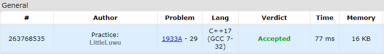

# 🐢 Turtle Puzzle: Rearrange and Negate

**Fonte: [Codeforces](https://codeforces.com/problemset/problem/1933/A)**

You are given an array a of n integers. You must perform the following two operations on the array (the first, then the second):

1. Arbitrarily rearrange the elements of the array or leave the order of its elements unchanged.

2. Choose at most one contiguous segment of elements and replace the signs of all elements in this segment with their opposites. Formally, you can choose a pair of indices l,r such that $1≤l≤r≤n$ and assign $a_i=−a_i$ for all $l≤i≤r$ (negate elements). Note that you may choose not to select a pair of indices and leave all the signs of the elements unchanged. 

What is the maximum sum of the array elements after performing these two operations (the first, then the second)?

### Entrada
The first line of the input contains a single integer t ($1≤t≤1000$) — the number of test cases. The descriptions of the test cases follow.

The first line of each test case contains a single integer n ($1≤n≤50$) — the number of elements in array a.

The second line of each test case contains n integers a1,a2,…,an ($−100≤ai≤100$) — elements of the array.

### Saída
For each test case, output the maximum sum of the array elements after sequentially performing the two given operations.

## 🧩 Processo de Resolução

> Detalhamento do processo em progresso..

## 📝 Corretude da Solução
A solução desenvolvida passou em todos os casos de testes.

