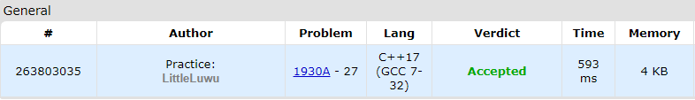

# ⏫ Maximise The Score

**Fonte: [Codeforces](https://codeforces.com/problemset/problem/1930/A)**

There are 2n positive integers written on a whiteboard. Being bored, you decided to play a one-player game with the numbers on the whiteboard.

You start with a score of 0. You will increase your score by performing the following move exactly n times:

- Choose two integers x and y that are written on the whiteboard.
- Add min(x,y) to your score.
- Erase x and y from the whiteboard.

Note that after performing the move n times, there will be no more integers written on the whiteboard.

Find the maximum final score you can achieve if you optimally perform the n moves.

### Entrada
Each test contains multiple test cases. The first line contains a single integer t ($1≤t≤5000$) — the number of test cases. The description of the test cases follows.

The first line of each test case contains a single integer n ($1≤n≤50$) — the number of integers written on the whiteboard is 2n.

The second line of each test case contains 2n integers $a_1,a_2,…,a_{2n}$ ($1≤a_i≤10^7$) — the numbers written on the whiteboard.

### Saída
For each test case, output the maximum final score that you can achieve.

## 🧩 Processo de Resolução

> Detalhamento do processo em progresso..

## 📝 Corretude da Solução
A solução desenvolvida passou em todos os casos de testes.

