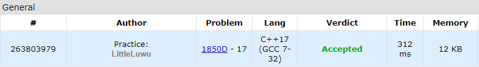

# ⚖️ Balanced Round

**Fonte: [Codeforces](https://codeforces.com/problemset/problem/1850/D)**

You are the author of a Codeforces round and have prepared n problems you are going to set, problem i having difficulty $a_i$. You will do the following process:

- remove some (possibly zero) problems from the list.
- rearrange the remaining problems in any order you wish.

A round is considered balanced if and only if the absolute difference between the difficulty of any two consecutive problems is at most k (less or equal than k).

What is the minimum number of problems you have to remove so that an arrangement of problems is balanced?

### Entrada
The first line contains a single integer t ($1≤t≤1000$) — the number of test cases.

The first line of each test case contains two positive integers n ($1≤n≤2⋅10^5$) and k ($1≤k≤10^9$) — the number of problems, and the maximum allowed absolute difference between consecutive problems.

The second line of each test case contains n space-separated integers $a_i$ ($1≤ai≤10^9$) — the difficulty of each problem.

Note that the sum of n over all test cases doesn't exceed $2⋅10^5$.

### Saída
For each test case, output a single integer — the minimum number of problems you have to remove so that an arrangement of problems is balanced.

## 🧩 Processo de Resolução

> Detalhamento do processo em progresso..

## 📝 Corretude da Solução
A solução desenvolvida passou em todos os casos de testes.

