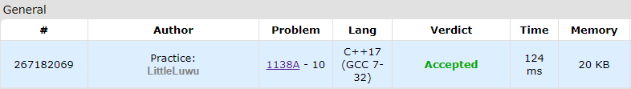

# 🍣 Sushi for Two

**Fonte: [Codeforces](https://codeforces.com/problemset/problem/1138/A)**

Arkady invited Anna for a dinner to a sushi restaurant. The restaurant is a bit unusual: it offers n
 pieces of sushi aligned in a row, and a customer has to choose a continuous subsegment of these sushi to buy.

The pieces of sushi are of two types: either with tuna or with eel. Let's denote the type of the i-th from the left sushi as $t_i$, where $t_i=1$ means it is with tuna, and $t_i=2$ means it is with eel.

Arkady does not like tuna, Anna does not like eel. Arkady wants to choose such a continuous subsegment of sushi that it has equal number of sushi of each type and each half of the subsegment has only sushi of one type. For example, subsegment [2,2,2,1,1,1] is valid, but subsegment [1,2,1,2,1,2] is not, because both halves contain both types of sushi.

Find the length of the longest continuous subsegment of sushi Arkady can buy.

### Entrada
The first line contains a single integer n ($2≤n≤100000$) — the number of pieces of sushi.

The second line contains nintegers $t_1, t_2, ..., t_n$ ($t_i=1$, denoting a sushi with tuna or $t_i=2$, denoting a sushi with eel), representing the types of sushi from left to right.

It is guaranteed that there is at least one piece of sushi of each type. Note that it means that there is at least one valid continuous segment.

### Saída
Print a single integer — the maximum length of a valid continuous segment.

## 🧩 Processo de Resolução

> Detalhamento do processo em progresso..

## 📝 Corretude da Solução
A solução desenvolvida passou em todos os casos de testes.

