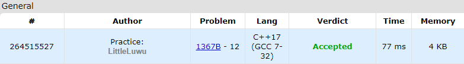

# 2️⃣ Even Array

**Fonte: [Codeforces](https://codeforces.com/problemset/problem/1367/B)**

You are given an array a[0…n−1] of length n which consists of non-negative integers. Note that array indices start from zero.

An array is called good if the parity of each index matches the parity of the element at that index. More formally, an array is good if for all i ($0≤i≤n−1$) the equality $i \mod 2= a[i] \mod 2$ holds, where $x \mod 2$ is the remainder of dividing x by 2.

For example, the arrays [0,5,2,1] and [0,17,0,3] are good, and the array [2,4,6,7] is bad, because for i=1, the parities of i and a[i] are different: $i \mod 2=1 \mod 2=1$, but $a[i] \mod 2=4 \mod 2=0$.

In one move, you can take any two elements of the array and swap them (these elements are not necessarily adjacent).

Find the minimum number of moves in which you can make the array a
 good, or say that this is not possible.

### Entrada
The first line contains a single integer t ($1≤t≤1000$) — the number of test cases in the test. Then t test cases follow.

Each test case starts with a line containing an integer n ($1≤n≤40$) — the length of the array a.

The next line contains n integers $a_0,a_1,…,a_{n−1}$ ($0≤ai≤1000$) — the initial array.

### Saída
For each test case, output a single integer — the minimum number of moves to make the given array a good, or -1 if this is not possible.

## 🧩 Processo de Resolução

> Detalhamento do processo em progresso..

## 📝 Corretude da Solução
A solução desenvolvida passou em todos os casos de testes.

