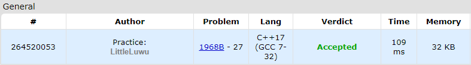

# 👩‍💻 Prefiquence

**Fonte: [Codeforces](https://codeforces.com/problemset/problem/1968/B)**

You are given two binary strings a and b. A binary string is a string consisting of the characters '0' and '1'.

Your task is to determine the maximum possible number k such that a prefix of string a of length k is a subsequence of string b.

A sequence a is a subsequence of a sequence b if a can be obtained from b by the deletion of several (possibly, zero or all) elements.

### Entrada
The first line consists of a single integer t ($1≤t≤10^4$) — the number of test cases.

The first line of each test case contains two integers n and m ($1≤n,m≤2⋅10^5$) — the length of string a and the length of string b, respectively.

The second line of each test case contains a binary string a of length n.

The third line of each test case contains a binary string b of length m.

It is guaranteed that the sum of values n over all test cases does not exceed $2⋅10^5$. Similarly, the sum of values m over all test cases does not exceed $2⋅10^5$.

### Saída
For each test case, output a single number — the maximum k, such that the first k characters of a form a subsequence of b.

## 🧩 Processo de Resolução

> Detalhamento do processo em progresso..

## 📝 Corretude da Solução
A solução desenvolvida passou em todos os casos de testes.

