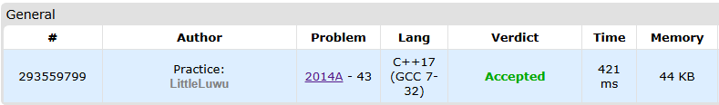

# 💰 Robin Helps

**Fonte: [Codeforces](https://codeforces.com/contest/2014/problem/A)**

The heroic outlaw Robin Hood is famous for taking from the rich and giving to the poor.

Robin encounters $n$ people starting from the $1$-st and ending with the $n$-th. The $i$-th person has $a_i$ gold. If $a_i≥k$, Robin will take all $a_i$ gold, and if $a_i=0$, Robin will give 1 gold if he has any. Robin starts with 0 gold.

Find out how many people Robin gives gold to.

### Entrada
The first line of the input contains a single integer $t$ ($1≤t≤10^4$) — the number of test cases.

The first line of each test case contains two integers $n$, $k$ ($1≤n≤50$,$1≤k≤100$) — the number of people and the threshold at which Robin Hood takes the gold.

The second line of each test case contains $n$ integers $a_1,a_2,…,a_n$ ($0≤a_i≤100$) — the gold of each person.

### Saída
For each test case, output a single integer, the number of people that will get gold from Robin Hood.

## 🧩 Processo de Resolução

> Detalhamento do processo em progresso..

## 📝 Corretude da Solução
A solução desenvolvida passou em todos os casos de testes.

