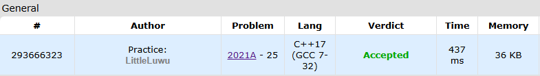

# 🧮 Meaning Mean

**Fonte: [Codeforces](https://codeforces.com/contest/2021/problem/A)**

Pak Chanek has an array $a$ of $n$ positive integers. Since he is currently learning how to calculate the floored average of two numbers, he wants to practice it on his array $a$.

While the array $a$ has at least two elements, Pak Chanek will perform the following three-step operation:

- Pick two different indices $i$ and $j$ ($1≤i$,$j≤|a|$; $i≠j$), note that $|a|$ denotes the current size of the array $a$.
- Append $⌊\frac{a_i+a_j}{2}⌋$ to the end of the array.
- Remove elements $a_i$ and $a_j$ from the array and concatenate the remaining parts of the array.

For example, suppose that $a=[5,4,3,2,1,1]$. If we choose $i=1$ and $j=5$, the resulting array will be $a=[4,3,2,1,3]$. If we choose $i=4$ and $j=3$, the resulting array will be $a=[5,4,1,1,2]$.

After all operations, the array will consist of a single element $x$. Find the maximum possible value of $x$ if Pak Chanek performs the operations optimally.

### Entrada
Each test contains multiple test cases. The first line contains the number of test cases $t$ ($1≤t≤5000$). The description of the test cases follows.

The first line of each test case contains a single integer $n$ ($2≤n≤50$) — the length of the array $a$.

The second line of each test case contains $n$ integers $a_1,a_2,…,a_n$ ($1≤ai≤10^9$) — the elements of the array $a$.

Do note that the sum of $n$ over all test cases is not bounded.

### Saída
For each test case, output a single integer: the maximum possible value of $x$ after all numbers have been picked.

## 🧩 Processo de Resolução

> Detalhamento do processo em progresso..

## 📝 Corretude da Solução
A solução desenvolvida passou em todos os casos de testes.

