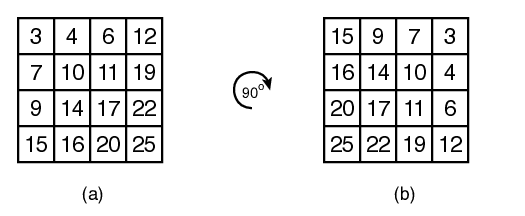
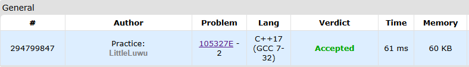

# 💎 Enigma of the Jewelry Case

**Fonte: [Codeforces](https://codeforces.com/gym/105327/problem/E)**

The princess of Nlogonia keeps her pearl collection in a square jewelry case made up of $N$ columns, each column containing $N$ small boxes. She places a different number of pearls in each box, and arranges the box so that in each column, from top to bottom, the boxes contain an increasing number of pearls and in each row, from left to right, the boxes also contain an increasing number of pearls.

The princess suspects that her little sister, who is very mischievous, is messing with her things in her games. In particular, the princess suspects that her jewelry case has been rotated 90 degrees clockwise, possibly multiple times.

Figure (a) below shows an example of the original arrangement of a $4×4$ case. Figure (b) shows the case rotated clockwise, 90 degrees, once.

Given the number of pearls in each box, write a program to determine the smallest number of 90-degree counterclockwise rotations that are necessary to return the jewelry case to its original state.

### Entrada
The first line of the input contains an integer $N$, the number of rows and columns in the case ($2≤N≤50$). Each of the following $N$ lines contains $N$ integers $K_i,j$, the number of pearls in the box in row $i$ and column $j$ ($0≤K_i$,$j≤10^5$, for $1≤i≤N$ and $1≤j≤N$). In the input, the rows are given from top to bottom, and the columns are given from left to right.

### Saída
Your program should output a single line containing only one integer $R$ (which can be 0, 1, 2, or 3), the smallest number of times the jewelry case must be rotated counterclockwise to return to its original state.

## 🧩 Processo de Resolução

> Detalhamento do processo em progresso..

## 📝 Corretude da Solução
A solução desenvolvida passou em todos os casos de testes.

