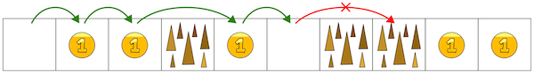
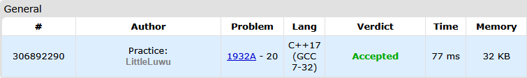

# 💰 Thorns and Coins

**Fonte: [Codeforces](https://codeforces.com/problemset/problem/1932/A)**

During your journey through computer universes, you stumbled upon a very interesting world. It is a path with $n$ consecutive cells, each of which can either be empty, contain thorns, or a coin. In one move, you can move one or two cells along the path, provided that the destination cell does not contain thorns (and belongs to the path). If you move to the cell with a coin, you pick it up.

###### *Here, green arrows correspond to legal moves, and the red arrow corresponds to an illegal move.*

You want to collect as many coins as possible. Find the maximum number of coins you can collect in the discovered world if you start in the leftmost cell of the path.

### Entrada
The first line of input contains a single integer $t$ ($1≤t≤1000$) — the number of test cases. Then the descriptions of the test cases follow.

The first line of each test case contains a single integer $n$ ($1≤n≤50$) — the length of the path.

The second line of each test case contains a string of $n$ characters, the description of the path. The character '.' denotes an empty cell, '@' denotes a cell with a coin, and '*' denotes a cell with thorns. It is guaranteed that the first cell is empty.

### Saída
For each test case, output a single integer, the maximum number of coins you can collect.

## 🧩 Processo de Resolução

> Detalhamento do processo em progresso..

## 📝 Corretude da Solução
A solução desenvolvida passou em todos os casos de testes.

