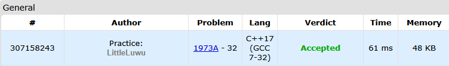

# ♟️ Chess For Three

**Fonte: [Codeforces](https://codeforces.com/problemset/problem/1973/A)**

Three friends gathered to play a few games of chess together.

In every game, two of them play against each other. The winner gets 2 points while the loser gets 0, and in case of a draw, both players get 1 point each. Note that the same pair of players could have played any non-negative number of times (possibly zero). It is also possible that no games were played at all.

You've been told that their scores after all the games were played were $p_1, p_2$ and $p_3$. Additionally, it is guaranteed that $p_1≤p_2≤p_3$ holds.

Find the maximum number of draws that could have happened and print it. If there isn't any way to obtain $p_1, p_2$ and $p_3$ as a result of a non-negative number of games between the three players, print −1 instead.

### Entrada
Each test contains multiple test cases. The first line contains the number of test cases $t$ ($1≤t≤500$). The description of the test cases follows.

The first line of each test case contains three integers $p_1, p_2$ and $p_3$ ($0≤p_1≤p_2≤p_3≤30$) — the scores of the three players, sorted non-decreasingly.

### Saída
For each testcase, print one number — the maximum possible number of draws that could've happened, or −1 if the scores aren't consistent with any valid set of games and results.

## 🧩 Processo de Resolução

> Detalhamento do processo em progresso..

## 📝 Corretude da Solução
A solução desenvolvida passou em todos os casos de testes.

