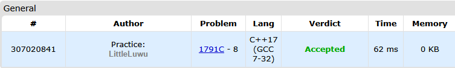

# #️⃣ Prepend and Append

**Fonte: [Codeforces](https://codeforces.com/problemset/problem/1791/C)**

Timur initially had a binary string† $s$ (possibly of length $0$). He performed the following operation several (possibly zero) times: 

- Add $0$ to one end of the string and $1$ to the other end of the string. For example, starting from the string $1011$, you can obtain either $010111$ or $110110$. 

You are given Timur's final string. What is the length of the shortest possible string he could have started with?

###### *† A binary string is a string (possibly the empty string) whose characters are either $0$ or $1$.*

### Entrada
The first line of the input contains an integer $t$ ($1≤t≤100$) — the number of testcases.

The first line of each test case contains an integer $n$ ($1≤n≤2000$) — the length of Timur's final string.

The second line of each test case contains a string $s$ of length n consisting of characters 0 or 1, denoting the final string.

### Saída
For each test case, output a single nonnegative integer — the shortest possible length of Timur's original string. Note that Timur's original string could have been empty, in which case you should output $0$.

## 🧩 Processo de Resolução

> Detalhamento do processo em progresso..

## 📝 Corretude da Solução
A solução desenvolvida passou em todos os casos de testes.

