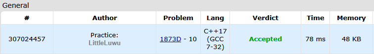

# 🖍️ 1D Eraser

**Fonte: [Codeforces](https://codeforces.com/problemset/problem/1873/D)**

You are given a strip of paper $s$ that is $n$ cells long. Each cell is either black or white. In an operation you can take any $k$ consecutive cells and make them all white.

Find the minimum number of operations needed to remove all black cells.

### Entrada
The first line contains a single integer $t$ ($1≤t≤1000$) — the number of test cases.

The first line of each test case contains two integers $n$ and $k$ ($1≤k≤n≤2⋅10^5$) — the length of the paper and the integer used in the operation.

The second line of each test case contains a string $s$ of length n consisting of characters $B$ (representing a black cell) or $W$ (representing a white cell).

The sum of $n$ over all test cases does not exceed $2⋅10^5$.

### Saída
For each test case, output a single integer — the minimum number of operations needed to remove all black cells.

## 🧩 Processo de Resolução

> Detalhamento do processo em progresso..

## 📝 Corretude da Solução
A solução desenvolvida passou em todos os casos de testes.

