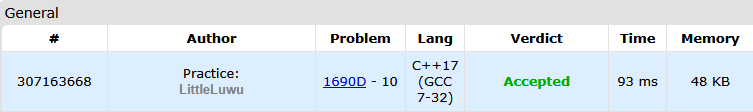

# 🔳 Black and White Stripe

**Fonte: [Codeforces](https://codeforces.com/problemset/problem/1690/D)**

You have a stripe of checkered paper of length $n$. Each cell is either white or black.

What is the minimum number of cells that must be recolored from white to black in order to have a segment of $k$ consecutive black cells on the stripe?

If the input data is such that a segment of $k$ consecutive black cells already exists, then print 0. 

### Entrada
The first line contains an integer $t$ ($1≤t≤10^4$) — the number of test cases.

Next, descriptions of $t$ test cases follow.

The first line of the input contains two integers $n$ and $k$ ($1≤k≤n≤2⋅10^5$). The second line consists of the letters 'W' (white) and 'B' (black). The line length is $n$.

It is guaranteed that the sum of values $n$ does not exceed $2⋅10^5$.

### Saída
For each of $t$ test cases print an integer — the minimum number of cells that need to be repainted from white to black in order to have a segment of $k$ consecutive black cells.

## 🧩 Processo de Resolução

> Detalhamento do processo em progresso..

## 📝 Corretude da Solução
A solução desenvolvida passou em todos os casos de testes.

