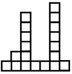
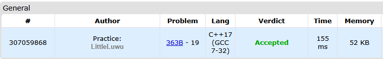

# 🚧 Fence

**Fonte: [Codeforces](https://codeforces.com/problemset/problem/363/B)**
There is a fence in front of Polycarpus's home. The fence consists of $n$ planks of the same width which go one after another from left to right. The height of the $i$-th plank is $h_i$ meters, distinct planks can have distinct heights.

###### *Fence for $n = 7$ and $h = [1, 2, 6, 1, 1, 7, 1]$*

Polycarpus has bought a posh piano and is thinking about how to get it into the house. In order to carry out his plan, he needs to take exactly $k$ consecutive planks from the fence. Higher planks are harder to tear off the fence, so Polycarpus wants to find such $k$ consecutive planks that the sum of their heights is minimal possible.

Write the program that finds the indexes of $k$ consecutive planks with minimal total height. Pay attention, the fence is not around Polycarpus's home, it is in front of home (in other words, the fence isn't cyclic).

### Entrada
The first line of the input contains integers $n$ and $k$ ($1 ≤ n ≤ 1.5·10^5$, $1 ≤ k ≤ n$) — the number of planks in the fence and the width of the hole for the piano. The second line contains the sequence of integers $h_1, h_2, ..., h_n$ ($1 ≤ h_i ≤ 100$), where hi is the height of the i-th plank of the fence.

### Saída
Print such integer $j$ that the sum of the heights of planks $j, j + 1, ..., j + k - 1$ is the minimum possible. If there are multiple such $j$'s, print any of them.

## 🧩 Processo de Resolução

> Detalhamento do processo em progresso..

## 📝 Corretude da Solução
A solução desenvolvida passou em todos os casos de testes.

