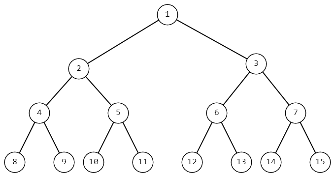
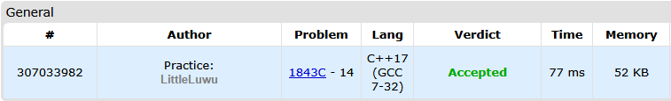

# 🌳 Sum in Binary Tree

**Fonte: [Codeforces](https://codeforces.com/problemset/problem/1843/C)**

Vanya really likes math. One day when he was solving another math problem, he came up with an interesting tree. This tree is built as follows.

Initially, the tree has only one vertex with the number $1$ — the root of the tree. Then, Vanya adds two children to it, assigning them consecutive numbers — $2$ and $3$, respectively. After that, he will add children to the vertices in increasing order of their numbers, starting from $2$, assigning their children the minimum unused indices. As a result, Vanya will have an infinite tree with the root in the vertex $1$, where each vertex will have exactly two children, and the vertex numbers will be arranged sequentially by layers.

###### *Part of Vanya's tree.* 

Vanya wondered what the sum of the vertex numbers on the path from the vertex with number $1$ to the vertex with number n in such a tree is equal to. Since Vanya doesn't like counting, he asked you to help him find this sum.

### Entrada
The first line contains a single integer $t$ ($1≤t≤10^4$) — the number of test cases.

This is followed by $t$ lines — the description of the test cases. Each line contains one integer $n$ ($1≤n≤10^16$) — the number of vertex for which Vanya wants to count the sum of vertex numbers on the path from the root to that vertex.

### Saída
For each test case, print one integer — the desired sum.

## 🧩 Processo de Resolução

> Detalhamento do processo em progresso..

## 📝 Corretude da Solução
A solução desenvolvida passou em todos os casos de testes.

